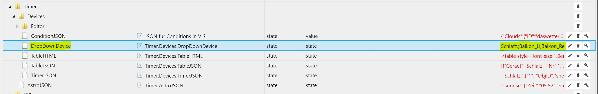

# Timer für ioBroker

Variable Zeitsteuerung mit VIS Editor und schneller Einrichtung

Dies ist kein Adapter sondern ein Skript und zwei VIS Views

Das Skript beinhaltet alle Funktionen, die benötigt werden. Einfach Inhalt kopieren und in iobroker ein neues JS Skript erstellen und Inhalt einfügen.
Für die schönere Optik verwende ich die CSS Klassen von Uhula (noch v1.x). Einfach nach "iobroker Material Design" schauen. Falls ihr noch kein Projekt von Uhula übernommen habt: der letzte Stand seiner CSS-Klassen findet ihr auch unten im angehängten Zip-File. Den Inhalt einfach im VIS-Editor unter dem Hauptreiter "CSS" einfügen.

Es gibt zwei Views, die importiert werden müssen. Zunächst die Hauptansicht und dann noch das PopUp-View für die Bearbeitung der Timer.

* [Hauptansicht Timer](#hauptansicht-timer)
* [Bedienung](#bedienung)
* [PopUp Editor](#popup-editor)
* [Konfiguration Skript](#konfiguration-skript)
* [Konfiguration VIS](#konfiguration-vis)
* [Weitere Infos](#weitere-infos)
* [Changelog](#changelog)

## Hauptansicht Timer


* Das oberste DropDown dient als Filter für die unten dargestellten Geräte. Nach Skript-Neustart werden immer alle Geräte angezeigt. Wenn der Filter nie genutzt wird, kann das DropDown auch gelöscht werden.

* In der Spalte "Bed" werden die Anzahl der hinterlegten Bedingungen angegeben. Die Farbe zeigt an, ob die Bedingungen insgesamt aktuell "true" oder "false" sind. Die States der Bedingungen triggern bei Änderungen sofort das Skript, sodass bei erkannter Änderung die betroffenen Timer neu ausgewertet werden.

* Im untersten DropDown-Feld wird der nächste Timer angezeigt. Beim Klick darauf erscheint die vollständige Liste mit allen zukünftigen Timern der nächsten sieben Tage.

* Sowohl das obere DropDown (für Filter) als auch das untere DropDown können gelöscht werden, falls diese nicht genutzt/gewünscht werden.

***

## Bedienung


Die Haupt-Tabelle mit den dargestellten Timern ist interaktiv:

* Sobald ein "Device", der "Aktiv-Status" oder die "Ist-Zeit" eines Timers **einmalig** angetippt wird, erscheinen zwei Buttons oben rechts. Es ist möglich, Timer hinzuzufügen (als Kopie des aktuell gewählten Timers) oder Timer zu löschen. Die Buttons verschwinden wieder nach 5s, sodass die Standardansicht immer "ungestört" ist.
* Ein **Doppelklick** auf das Device öffnet den Editor für den Timer.
* Ein **Doppelklick** auf den Aktiv-Status schaltet diesen Status um (toggle).
* Über die Variable `var oneClick` im oberen Skript-Bereich kann das Klick-Verhalten umgestellt werden. Toggle des Aktiv-Status und Eiditeren über IST-Zeit geht dann über Einfach-Klick

***

## PopUp Editor


* Die Einstellung der gewünschten Zeit sollte selbsterklärend sein...
* Die **Anzahl der Bedingungen** muss über das DropDown gewählt werden. Der rechte Vergleichswert wird "allgemein" über die Tastatur eingegeben. Es müssen ja  beliebige Zahlenwerte oder Zeichen angegeben werden können. Ist der State einer Bedingung in ioBroker als boolean angelegt, wird dies aber automatisch erkannt: als Vergleichswerte werden dann "true" und "false" in einem Dropdown angezeigt. 
* Jeder Timer kann einer **Gruppe** zugeordnet werden. Über die unteren beiden Bool-Switch können die Einstellungen der "Zeit" (Astro, Offset, usw.) und die Einstellungen der "Bedingungen" (Anzahl, Bedingungen an sich, Timer-Merken Status) für alle Timer derselben Gruppe übernommen werden.
* Manche Widgets werden erst sichtbar, wenn die Anzahl der Bedingungen > 0 gewählt wird.
* Wenn die Bedingungen unvollständig oder fehlerhaft sind, wird das PopUp Fenster nicht geschlossen. Eine Fehlermeldung erscheint.
* Bedingungen werden während der Eingabe ausgewertet und farblich hervorgehoben.
* **Timer merken**: Nur sinnvoll wenn Bedingungen genutzt werden.
  **Beispiel**: Licht an um 18:00 Uhr, wenn niemand Zuhause ist. **Timer merken = nicht aktiv**.
  Wenn um 18:05 Uhr das Haus verlassen wird, wäre der Zeitpunkt des Timers bereits verstrichen und das Licht geht nicht an. Bedingung wurde zu spät erfüllt.
  **Beispiel**: Licht an um 18:00 Uhr, wenn niemand Zuhause ist. **Timer merken = aktiv**.
  Um 18:00 Uhr (noch daheim) wird das Licht nicht geschaltet, aber der Timer wird gespeichert (Darstellung: Bedingungen Rot-Blinkend in Tabelle). Wenn um 18:05 Uhr das Haus verlassen wird, wird in diesem Beispiel das Licht nachträglich eingeschaltet.
  Zwischengespeicherte Timer werden aus dem Speicher gelöscht, ...
  - wenn nachträglich die Bedingungen erfüllt und der Timer ausgeführt wird
  - wenn ein nachfolgender aktiver Timer des selben Geräts seine Ziel-Uhrzeit erreicht. Sonderfall: Wird im nachfolgenden Timer der Sollwert "Reset" gewählt, wird damit ausschließlich ein ggf. zwischengespeicherter Timer gelöscht; das Gerät wird nicht mit dem Sollwert "Reset" gesteuert!
  - wenn das Ziel-Gerät (im Beispiel = "Licht") unabhängig vom Timer geschaltet wurde (z.B. Licht von Hand eingeschaltet)
  - durch manuelles Deaktivieren/Löschen über Doppelklick auf HTML-Tabelle:
    In Überschrift "Bed" löscht alle ausstehenden Timer, in einzelne Zeile auf die Bedingungen-Anzahl löscht einzeln. Doppelklick kann auf Einfach-Klick umgestellt werden, indem Variable `var oneClick` auf `true` gesetzt wird.
  - durch setzen des neu erstellten Button-States "javascript.0.Timer.Devices.ResetBackgroundTimers"

***

## Konfiguration Skript

Alle **Geräte**, die gesteuert werden sollen, müssen in eine Aufzählung gepackt werden. Es können Objekte mit den Sollwerten "True/False" oder mit numerischen Werten "0 bis 100" eingesetzt werden. In der Aufzählung müssen States (bei Rollläden z.B. die *.level Objekte) vorhanden sein, keine Channels o.ä.

Diese Aufzählung wird oben im Skript angegeben, z.B. "enum.functions.blinds":

```js
// Eine Aufzählung für Geräte (z.B. Rollläden) angeben:
var deviceEnum = "enum.functions.blinds";
```

Für alle Timer können individuell über die VIS **Bedingungen** angegeben werden. So werden Timer nur gesetzt, wenn die hinterlegten Bedingungen erfüllt sind. Die States, die als Bedingungen gewählt werden sollen, müssen über eine Aufzählung integriert werden, z.B. "enum.functions.timerconditions":

```js
// Eine Aufzählung für States der Bedingungen:
var deviceCond = "enum.functions.timerconditions";
```

Wenn die Aufzählung für die Bedingungen verändert wird (States werden gelöscht oder hinzugefügt), dann muss nur das Skript neu gestartet werden. Die Auswahl-Liste wird dann neu erstellt.

## Konfiguration VIS

* Die beiden Views werden ganz normal über den Editor importiert. Das Popup-View sollte den Namen **cardTimerEditor** erhalten, ansonsten muss der Verweis im Widget "Edit" des Haupt-Views angepasst werden.

* Falls das Dialog Widget von Scroungers "Material Design Adapter" verwendet wird, muss für die Steuerung der Dialog-Box das erstellte State "MaterialDialogWidgetOpen" verwendet werden.

* Aktuell wird der HTML Code vollständig in ein State geschrieben, der im HTML Widget der Hauptansicht hinterlegt ist.
  Evtl besteht der Wunsch, für jedes Gerät ein eigenes HTML Widget zu nutzen. Hierfür habe ich nun einen Software-Schalter integriert (splitHTML).
  Steht der Schalter auf "false" wird alles in ein State geschrieben (default). Wird der Schalter auf "true" gesetzt, wird für jedes Gerät der Aufzählung ein State erstellt und nur die relevanten Timer dort hinzugefügt. Die Konfiguration der Timer erfolgt allerdings weiterhin über die vorhandenen DropDowns und dem PopUp. Im gesplitteten HTML-Code habe ich die Spalte für den Gerätenamen entfernt.
  
  ```js
  // HTML Code aufteilen? Wenn pro Gerät eine eigenständige HTML Tabelle verwendet werden soll
  var splitHTML = false;
  // false: HTML Code wird vollständig in "Timer.Devices.TableHTML" geschrieben
  // true : HTML Code nach Geräten aufteilen -> "Timer.Devices.HTML_<GeräteName>"
  ```

## Weitere Infos

Rest läuft soweit, wenn das Skript gestartet wird. Nach dem ersten Start werden Fehler im Log angezeigt (weil states noch nicht existieren). Einfach nochmal starten, dann sollte es fehlerfrei laufen.
Es können für jedes Gerät bis zu 19 Timer in der VIS erstellt werden. Ein neuer Timer wird immer als Kopie des letzten Timers erstellt (z.B.: Werte in neuen Timer 3 sind eine Kopie aus Timer 2).

Soll ein Gerät aus der Liste gelöscht werden, einfach das Gerät aus der Aufzählung entfernen und die zugehörigen Timer in der VIS mit dem "Del"-Button löschen.
Soll ein Gerät neu in die Liste, so kann die Aufzählung damit erweitert werden und im Anschluss das Skript restarten. Es wird das neue Gerät nun mit den beiden nicht-aktiven Default-Timer erstellt.

Einige Funktionalitäten der VIS-Tabelle können im oberen Skript-Bereich der Variablen verändert werden, einfach oben durchscrollen und Kommentare lesen...

***

**Die Reihenfolge der Timer-Geräte** innerhalb der Tabelle kann über das folgende State verändert werden:



Geänderte Reihenfolge wird erst korrekt angezeigt, wenn ein Timer z.B. aktiviert/deaktiviert wird oder das Skript neu gestartet wurde.

---

**Zusätzliche Sollwerte oder deren Anpassungen** können über die folgenden Variablen ergänzt werden:

```js
// Soll-Werte für States, die nicht als Bools hinterlegt sind. Zahlenwerte können hier angepasst/gelöscht werden.
var sollDropDown = "0;5;10;15;20;30;40;50;60;70;80;90;100;Auf;Ab";
// Soll-Werte für Bool-States true/false (werden automatisch erkannt)
var sollDropDownBool = "An;Aus";
// Falls Soll-Werte individualisiert wurden, bitte nachfolgend die realen Werte hinterlegen/anpassen
var sollWertMapping = {"Auf": 100, "Ab": 0, "An": true, "Aus": false}
```

Wenn ein Gerät als boolean erkannt wird, werden im Timer-Editor der VIS die beiden Werte der Variable `sollDropDownBool` zur Auswahl gestellt.

Andernfalls stehen die Werte aus `sollDropDown` zur Auswahl, z.B. bei Rollläden.

Die Werte dieser beiden Variablen sind nur die angezeigten Werte der VIS Tabelle! Was in Richtung Zielgerät geschrieben wird, kann( oder muss ) in `sollWertMapping` stehen bzw. ergänzt werden.

<u>Funktionalität:</u>

Der Sollwert aus der VIS wird immer in `sollWertMapping` gesucht. Wird ein Treffer erzielt, wird der VIS-Sollwert ersetzt durch den Mapping-Wert. `Auf` aus der VIS wird somit durch `100` ersetzt; oder `An` durch `true`. Wenn in der Mapping-Variable ergänzt, könnte auch ein Zahlenwert `70` durch `50` ersetzt werden. Wertkorrekturen, z.B. für Rollläden, wären somit möglich. Wird ein VIS-Wert in der Mapping-Liste nicht gefunden, wird dieser VIS-Wert in Richtung Zielgerät geschrieben (so geschehen hier mit allen Zahlenwerten)

***

## Changelog

**Changelog v1.3.2 20.12.2020 (Skript)**

* Bugfix: Wenn bei den Bedingungen Strings als Vergleichswerte eingegeben werden müssen, können "" oder '' weggelassen werden!

**Changelog v1.2.1 30.11.2020 (Skript)**

* Bugfix: Updates der IDs von Bedingungen funktioniert nun ohne Fehlermeldung
  * Wenn gleichnamige Ersetzungen in der Aufzählung für Bedingungen oder für die Zielgeräte stattfinden, dann werden in allen Skript- und JSON-Elementen die neuen State-IDs übernommen
* Lange String Passagen durch Backtick Strings ersetzt (Code besser zu lesen)

**Changelog v1.2.0 22.11.2020 (Skript + VIS[optional] )**

* Offsets können nun auch größer 59 Minuten gewählt werden
* Bugfix: Es wurden unnötige States unter Timer.Devices.States.x erstellt
* - Alle Widgets im Editor-View benamt

**Changelog V1.1.0 20.11.2020 (Skript + VIS[optional] )**

* Bugfix bei der Scroll-Eigenschaft der Bedingungen im Editor
* Widget-ID des EDIT-Buttons muss oben im Skript nicht mehr angegeben werden.
  Widget-ID wird nun gefunden: Dafür muss im EDIT-Widget unter CSS-Klasse der Eintrag "dialogIdentifier" (ohne "") ergänzt werden.
  Änderung muss bei Update von bestehender Version nicht durchgeführt werden. Abwärtskompatibilität ist gegeben.

**Changelog V1.0.0 19.11.2020 (Skript)**

* Auto-Scroll innerhalb VIS Haupttabelle nun ohne Flackern umgesetzt
* Aktualisierte States werden in Skript übernommen, wenn in Aufzählungen (Devices und/oder Conditions) gleichnamige Namen mit veränderten ioBroker States erkannt werden

**Changelog 18.10.2020 (Skript)**

* Scroll-Positionen von Main-Tabelle und Editor-Bedingungen werden gespeichert
* Header der Main-Tabelle können über optionale Variable "withHeader" deaktiviert werden

**Changelog 11.10.2020 (Editor-View)**

* Bugfix bei Buttons Mo - Do, Ursache weiterhin unklar aber nun fehlerfrei

**Changelog 04.10.2020 (Skript)**

* HTML-Style für Bedingungen in den Bereich der Variablen integriert (var condStyle = optional)
* Bugfix: Timing zur HTML-Erstellung der Editor-Bedingungen korrigiert
* Bugfix: gemerkte Timer im Hintergrund werden in jedem Fall durch nachfolgende Timer gelöscht

**Changelog 09.08.2020 (Skript)**

* Verschiedene Bugs behoben

**Changelog 08.08.2020 (Skript + Editor-View)**

* Anzahl Bedingungen von 3 auf 9 erweitert
* Bedingungen werden in Editor-View als HTML-Tabelle angezeigt
* Im Editor-View wird nun ENTWEDER Zeile "Zeiteingabe" ODER "Offset" angezeigt.
* Timer-JSON und EDITOR-States werden mit Skript-Update ergänzt

**Changelog 18.07.2020 (Skript)**

* Bugfixes: Falls Random-Minuten auch für gemerkte Timer genutzt wird (bgTimerWithRandom = true), wird eine doppelte AUsführung verhindert.
* Der Fall "Random-Minuten für gemerkte Timer" wird nun vollumfänglich unterstützt; d.h. der Countdown wird unterbrochen im Falle von "Reset durch nachfolgenden Timer" oder falls das Ziel-Gerät anderweitig verändert wurde.

**Changelog 16.07.2020 (Skript + Main-View + Editor-View)**

* Selbes Editor-View (PopUp) für mehrer Timer nutzbar! State-Verlinkungen geändert!
* Neue Variable definiert: bgTimerWithRandom (optional) => Random-Minuten auch für gemerkte Timer nutzen?
* Instanz wird im Skript dynamisch gesetzt. Skript in Javascript-Instanz ">0" lauffähig!
* Sollwert-DropDown wurde mit "Reset" erweitert. Im Hintergrund befindliche Timer (gemerkt) können durch diese Sollwert-Vorgabe im nachfolgenden Timer gelöscht werden. Gerät wird nicht aktiv mit Sollwert "Reset" gesteuert.
  * Im Mainview State-Verlinkungen zu den drei Buttons "ADD", "DEL" und "EDIT" geändert.

**Changelog 30.06.2020 (Skript)**

* Codeoptimierung, Error-Handling wenn Buttons nicht gemäß Standard genutzt werden
* Bugfix: Alle gemerkten Timer werden nun ausgeführt, wenn Bedingungen nächträglich erfüllt werden.

**Changelog 20.06.2020 (Skript)**

* State "javascript.0.Timer.AtHomeSimul.TableJSON" gelöscht, wird nicht mehr benötigt.
* Bugfix: Bei Tabellen mit modifizierter Reihenfolge funktioniert nun auch die Filterung korrekt!

**Changelog 17.06.2020 (Skript)**

* Steuerung der Geräte mit Versatz möglich. Neue (optionale) Variable "sendWithOffset"

**Changelog 30.05.2020 (Skript)**

* Bugfix "ErrorMessage" im PopUp
* Neue Variable im Edit-Bereich: logSuffix
  Kann genutzt werden, um Log-Ausgabe noch flexibler anzupassen (Ist für manuelles Update nicht zwingend neu anzulegen)

**Changelog 29.05.2020 v2**

* DialogBox Button "Abbrechen" ersetzt durch Standard-Button. Schließen des Dialogs über Skript (Bugfix bei Verwendung von MD-Adapter Dialog).

**Changelog 29.05.2020**

* Steuerung des Dialog Widgets vom "Material Design Adapter" über State "javascript.0.Timer." + path + ".MaterialDialogWidgetOpen"
* Meldung bei fehlerhaften Bedingungen in PopUp
  -> Bei manuellem Update, Widgets "Berechnete Uhrzeit" und "ErrorMsg" aus Export übernehmen

**Changelog 26.04.2020**

* Minütliches Flackern der nächsten Timer abgestellt. Nur noch bei Änderungen gibts ein Flackern
* Bedingungen werden während der Eingabe ausgewertet und farblich im Editor hervorgehoben (Danke an HelmutS)
* Wenn Bedingungen leer oder fehlerhaft sind, wird das PopUp-Fenster nicht geschlossen. Log wird ausgegeben.

**Changelog 15.04.2020**

* PopUp-Editor ohne zusätzliche PNGs für Tage, rein als HTML-Button (siehe Screenshot)
* Funktionen innerhalb Tabelle können nun wahlweise mit Einfach-Klick statt Doppelklick ausgeführt werden (außer in Spalte "Device", diese Spalte dient als Haupt-Markierung für ADD/DEL, hier wird immer mit Doppelklick der Editor geöffnet).
* Neue Variable "oneClick" im Variablen-Bereich hinzugefügt (Default: oneClick = false)
* Neue Variablen müssen ab dieser Version bei einem manuellen Update nicht zwingend übernommen werden!
  Falls neue Variablen im oberen Bereich nicht existieren, wird der Default-Wert der neuen Variable angenommen. So soll sichergestellt werden, dass neue Funktionen die Funktionsweise älterer Versionen nicht beeinflusst  

**Changelog 29.03.2020 v2**

* Sollwerte können über Variablen-Feld oben einfacher angepasst werden
* Zusätzlich zwei Variablen im oberen Feld: "sollDropDownBool" und "sollWertMapping"

**Changelog 29.03.2020**

* Einzelne Aktive Background-Timer aus "Timer merken" können vorzeitig über Doppelklick auf die Bedingungszahl gelöscht werden
* Das Löschen aller aktiven Background-Timer kann über ein Doppelklick auf Tabellen-Überschrift "Bed" oder separat über das neue State "javascript.0.Timer.Devices.ResetBackgroundTimers" durchgeführt werden.

**Changelog 26.03.2020**

* Bugfix für font-size der Tabelle (wurde zuvor nicht korrekt übernommen)
* Gruppenzuordnungen unterteilt in "Zeiten" und "Bedingungen"
* Funktion "Timer merken" hinzugefügt:
  - Timer wird gemerkt für den Fall dass die Bedingungen erst nach Trigger-Uhrzeit "true" werden.
  - Timer werden aus der "Merkliste" vorzeitig gelöscht, falls sich die Ziel Objekt-ID anderweitig ändert oder der nächste Timer des Devices aktiviert wird.
* "javascript.0.Timer.Devices.Editor.DropDownNr" wird seit Touch-Bedienung nicht mehr benötigt. Kann gelöscht werden.

**Changelog 03.02.2020**

* Bugfix Gruppenzuordnung

**Changelog 30.01.2020**

* Optik PopUp für Gruppenzuordnung angepasst
* Namen der Gruppen im Skript nach oben gesetzt, für bessere Anpassung (Default: A bis J)

**Changelog 26.01.2020**

* Timer werden Gruppen zugeordnet (aktuell statisch bis zu 10 Gruppen möglich)
* Änderungen über alle Timer einer Gruppe verteilen möglich
* Gruppennummer kann optional in Tabelle angezeigt werden
* Neue Spalte mit Symbolen (Aktiv-Status) anzeigbar und darüber auch manipulierbar (Doppelklick)
* Hinweis: Entweder Symbole oder Timer-Nummer muss angezeigt werden um Timer über Doppelklick zu aktivieren/deaktivieren
* Schriftgröße über Variable "fontSize" änderbar
* HTML-Code-Generierung aufgeräumt
* PopUp mit DropDown für Gruppenzuordnung erweitert
* Gefilterte Darstellung ohne "Device"-Spalte, da hier unnötig

**Changelog 24.01.2020**

* Bugfix bzgl. Doppelklick zum Editieren und Aktivieren/Deaktivieren der einzelnen Timer

**Changelog 19.01.2020**

* Auswahl des Timers direkt über Tabelle (onclick event)
* Edit mit Doppelklick Gerät oder Ist-Zeit (dblclick event)
* Aktivieren/Deaktivieren des Timers über Doppelklick auf Timer-Nummer
* DropDown in VIS zu Filter umfunktioniert, default = kein Filter (DropDown auch löschbar!)
* Filter DropDown bei Split-Darstellung ohne Funktion
